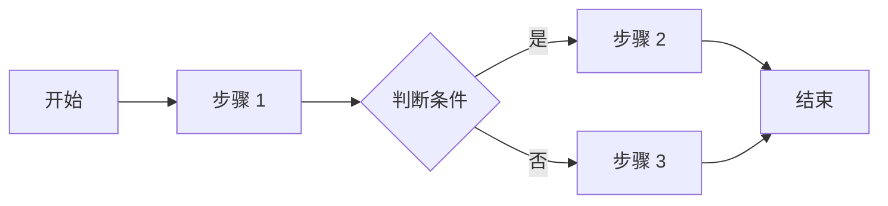
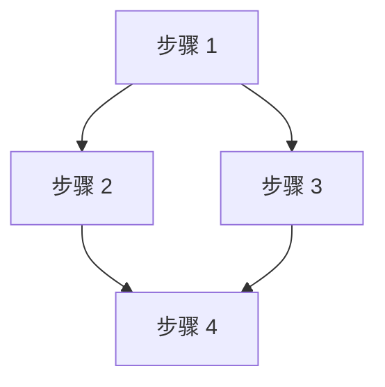
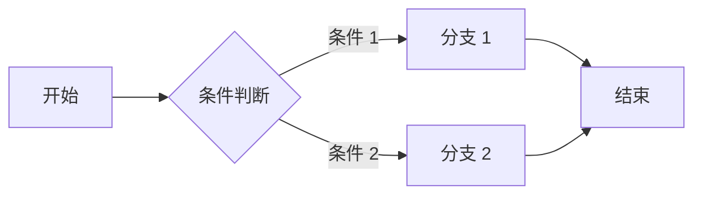
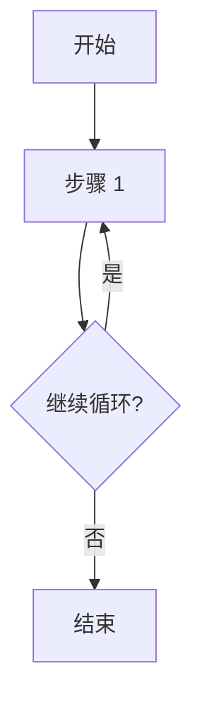
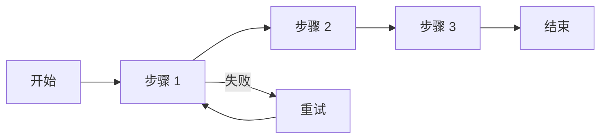

# Mermaid 流程图示例

## 基础流程图

```mermaid

flowchart LR
A[开始] --> B[步骤 1]
B --> C{判断条件}
C -->|是| D[步骤 2]
C -->|否| E[步骤 3]
D --> F[结束]
E --> F
```

## 子流程图

```mermaid
subgraph 子流程
A1[步骤 A] --> A2[步骤 B]
A2 --> A3[步骤 C]
end
A1 --> A2
```

## 并行流程

```mermaid
flowchart TD
A[步骤 1] --> B[步骤 2]
A --> C[步骤 3]
B --> D[步骤 4]
C --> D
```

## 带条件分支

```mermaid
flowchart LR
A[开始] --> B{条件判断}
B -->|条件 1| C[分支 1]
B -->|条件 2| D[分支 2]
C --> E[结束]
D --> E
```

## 带循环的流程

```mermaid mermaid
flowchart TD
A[开始] --> B[步骤 1]
B --> C{继续循环?}
C -->|是| B
C -->|否| D[结束]
```

## 带注释的流程

```mermaid
flowchart LR
A[开始] --> B[步骤 1]
B --> C[步骤 2]
C --> D[步骤 3]
D --> E[结束]
%% 注释：步骤 2 可能失败
B -->|失败| F[重试]
F --> B
```
